# The Cases

## John Snow and the Cholera Epidemic

How demarcation helped John Snow figure out that water caused cholera to spread in the 19th century

](images/snow1.png)

 

 The Puzzle 

In the mid-19th century, cholera was claiming the lives of thousands in London. But how did the disease spread? In other words, what was the main mode of transmission of cholera?

For an overview of this case, see our [introductory story map](https://uploads.knightlab.com/storymapjs/a0d512bc2bc17977f1029fedead0329a/trying-out/draft.html) and [video](https://youtu.be/lGN8SK1Y1h4).

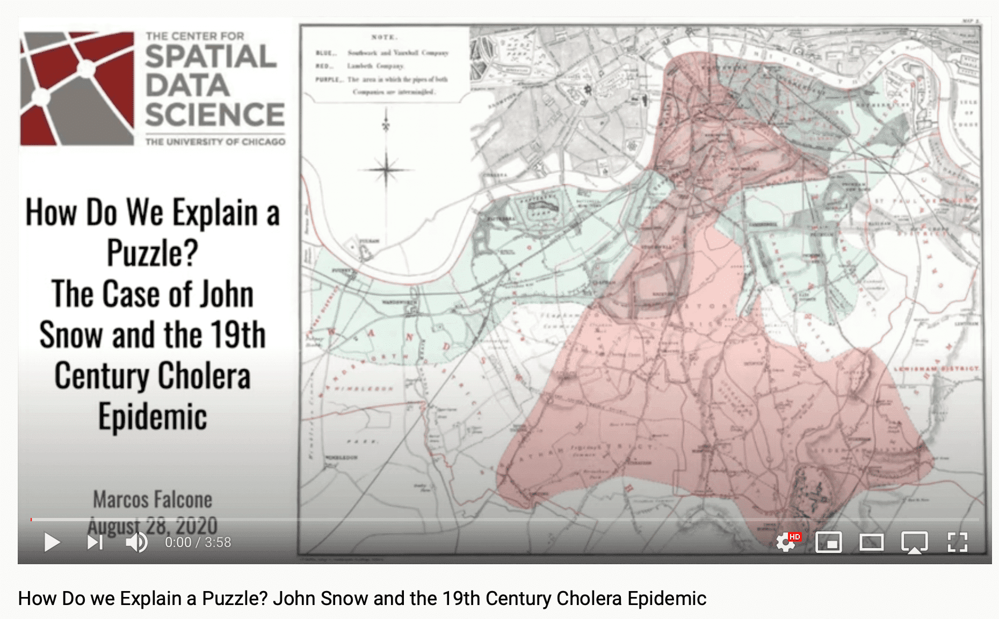

 The Research Design 

To answer that question, a doctor named John Snow developed a waterborne theory of cholera and then studied the locations where the disease was prevalent as well as those where it was not, along with specific locations where water suppliers varied. 

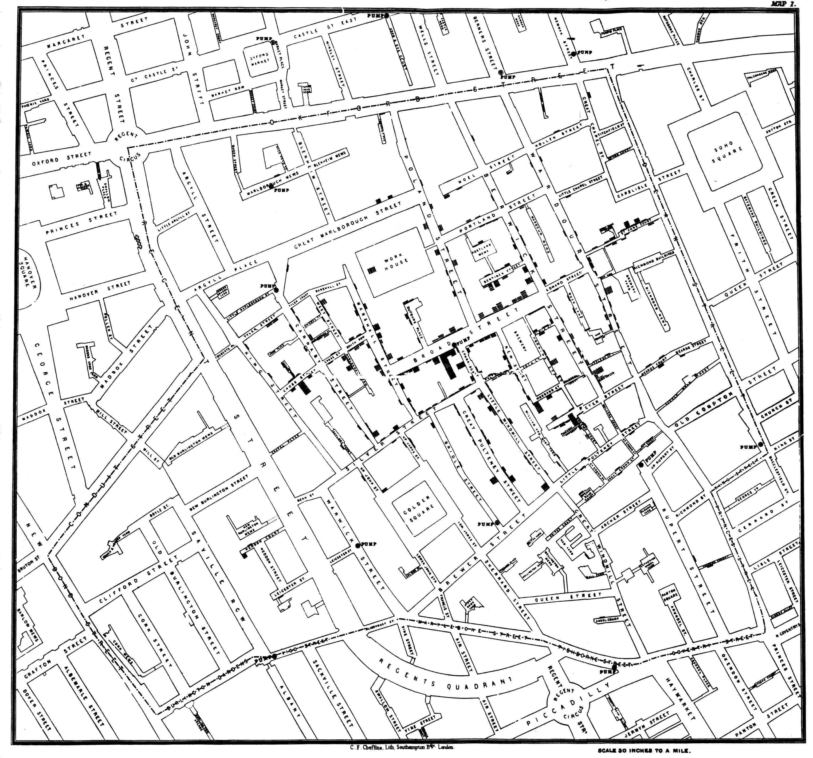

By demarcating cases in this way and testing his theory at both a micro (Soho) and a macro level (South London), Snow was able to gather evidence that was compatible with the waterborne theory of cholera but was harder to account for by the airborne theory.

For more detail on the research designs devised by Snow and his contemporaries, see our [specialized story map](https://docs.google.com/presentation/d/e/2PACX-1vTpkyf_CSeAgD8datvssFfNHHwypUEYIg-tAC-cNaj6Nu_wrqqIOdsT_Y4phZYl8EBJA_OyWvrFhJfV/pub?start=false&loop=false&delayms=3000&slide=id.g9d798a6fd3_0_81) and video.

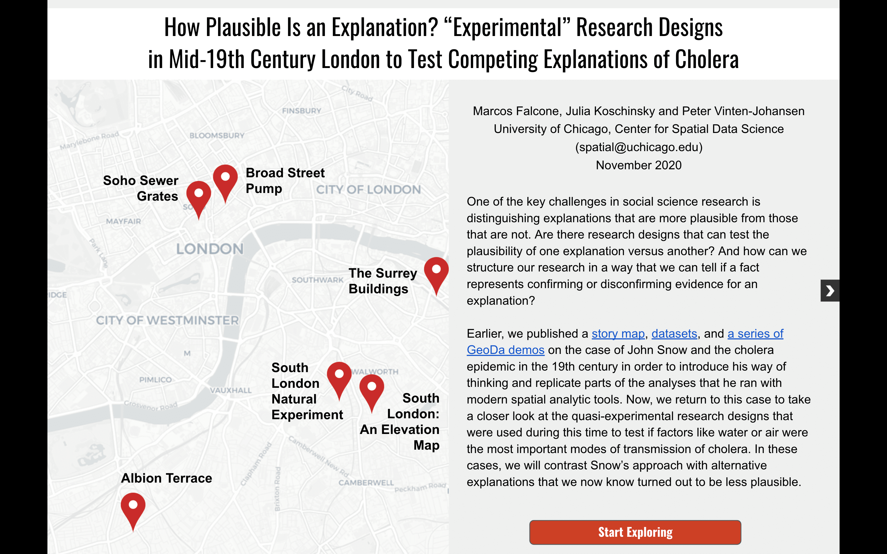

 The Tools 

Using cluster analysis and other statistical techniques like conditional plots and averages charts, it is today possible to replicate and illustrate Snow’s analyses with our [GeoDa demo scripts](https://geodacenter.github.io/data-and-lab/data/geoda_scripts_snow.pdf).

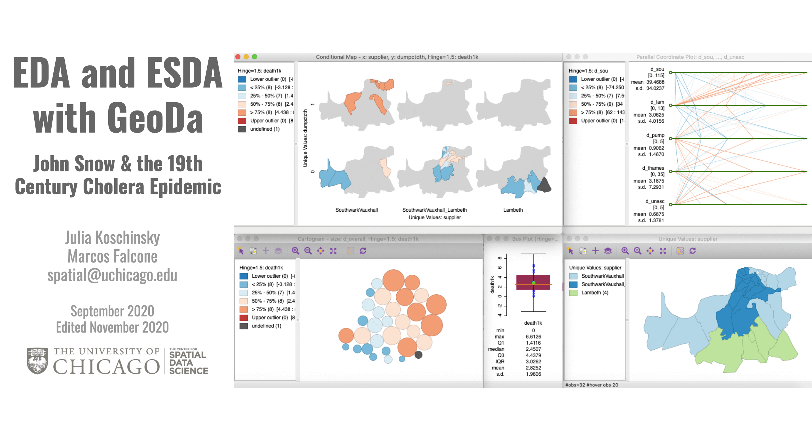

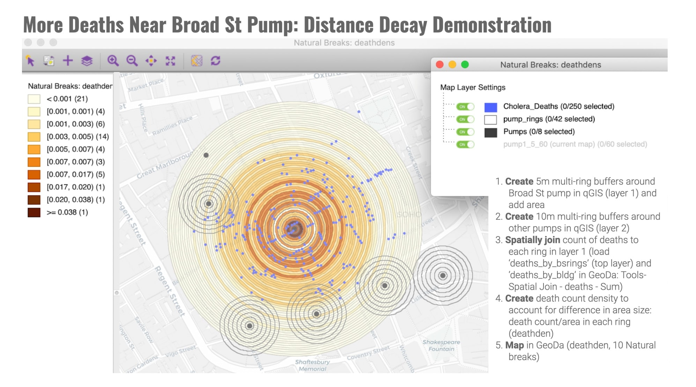

 The Insights 

Snow used a natural experiment to find out that cholera cases concentrated in groups of people who relied on specific water supply mechanisms, whereas groups which relied on a different water supply were not affected even if they were located right next to clusters of infections.

 More Information 

Access our [data](https://geodacenter.github.io/data-and-lab/snow/) and [documentation](https://geodacenter.github.io/data-and-lab/data/snow_documentation.pdf) to replicate these findings in [GeoDa](https://geodacenter.github.io).

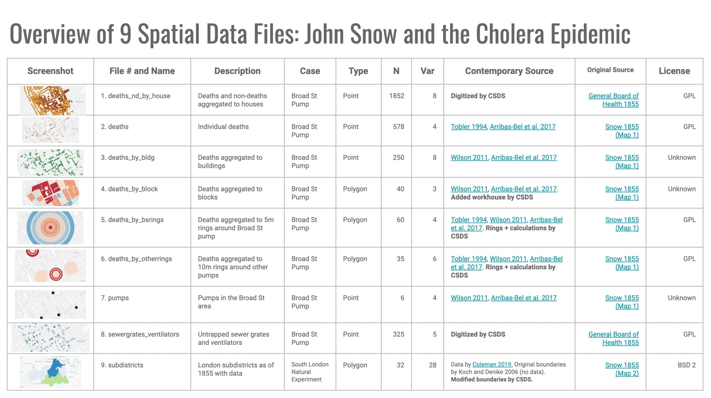

## Sherlock Holmes and the Napoleon Busts

Finding a key common feature of the smashed Napoleon busts allowed the famous detective to solve the mystery of why they were smashed. 

](images/sherlock1.jpg)

 

 The Puzzle 

In [The Adventures of the Six Napoleons](https://sherlock-holm.es/stories/pdf/a4/1-sided/sixn.pdf), the famous detective Sherlock Holmes faced a mystery: Napoleon busts were being destroyed in private property across the city of London and nobody knew why. 

For an overview of this case, see our [story map](https://docs.google.com/presentation/d/e/2PACX-1vS1ADwo9Uj2JQ-jSqV3Yd1u00FUA33m20NcWvh0qW78axsJ-a-hCMmThFmBjNAyMNnhrcBQVeZxkIB9/pub?start=false&loop=false&delayms=3000) and [video](https://www.youtube.com/watch?v=Fu-4NmiuxJI).

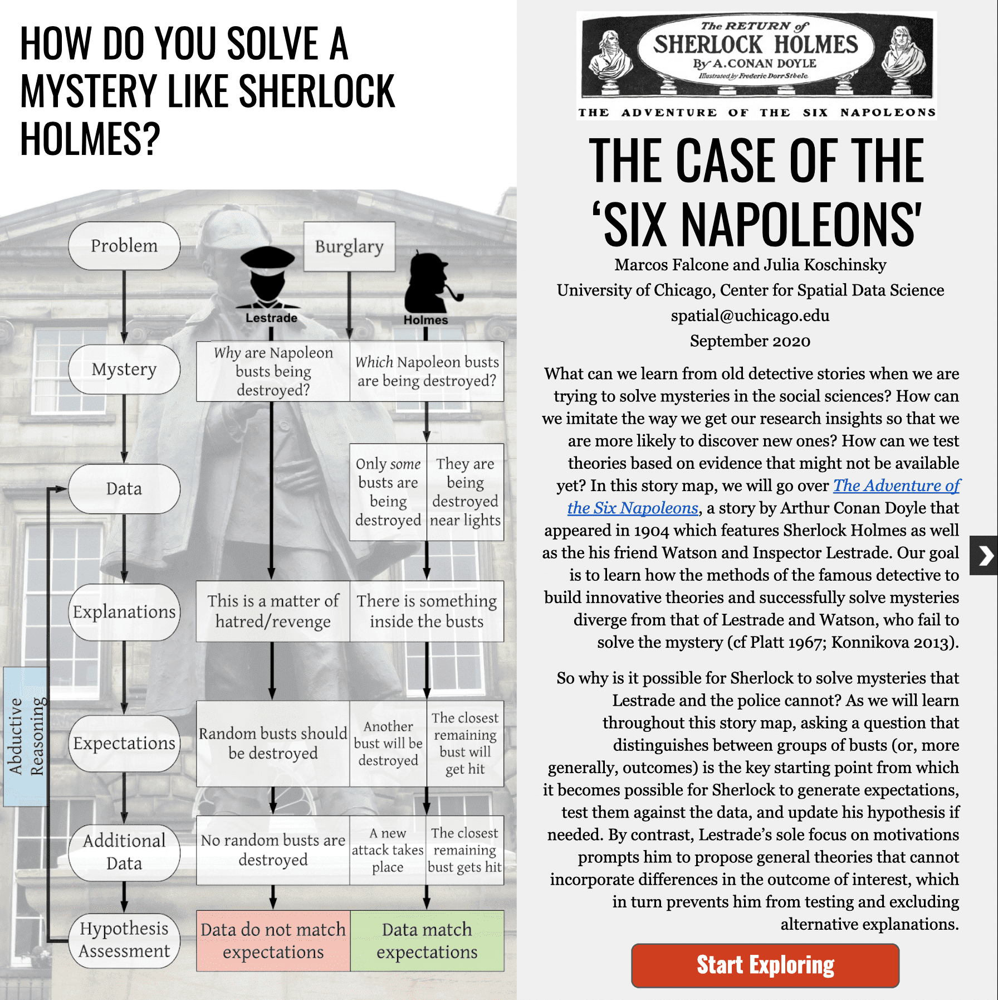

 The Research Design 

Policemen initially thought that hatred was causing someone to break the busts -- or that they were dealing with a potential vendetta.

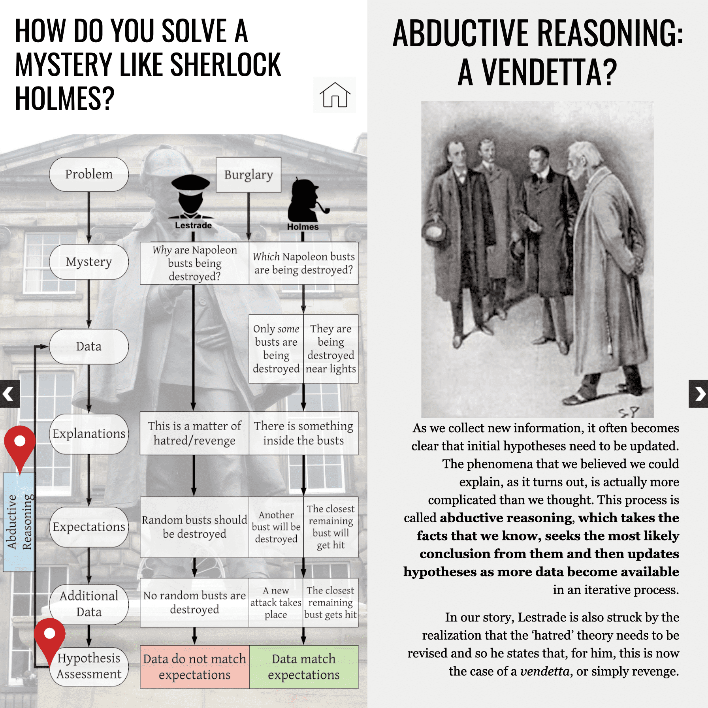

According to Sherlock, however, neither of these theories explained why only a specific subset of busts was being smashed. By observing the circumstances of the attacks and discovering that the busts came from the same manufacturer and the same batch, he came up with the theory that there was a hidden object inside one of these busts. He then predicted which bust would be the next to be destroyed, alerted the police and conducted a quasi-natural experiment at the location where he thought that the attack would take place.

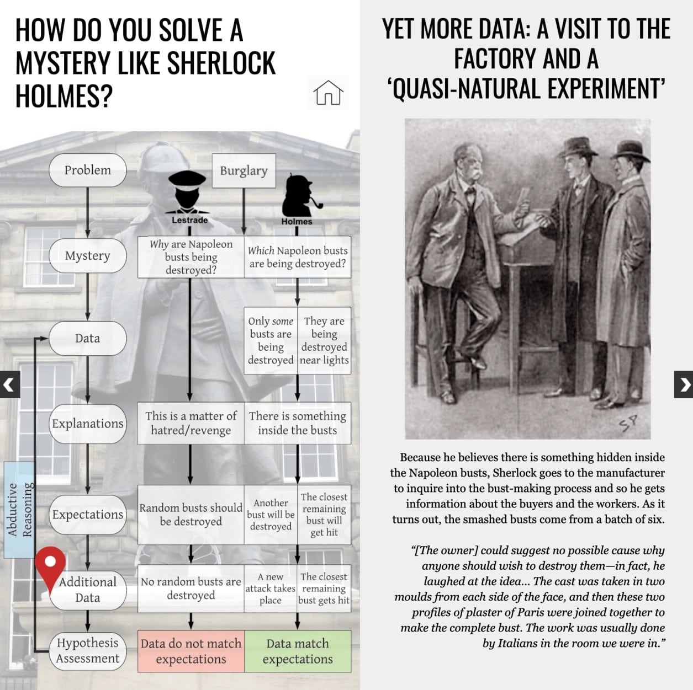

 The Insights 

As it turned out, Sherlock was right and the burglar was caught on site. Basing his approach on demarcation and a quasi-natural experimental setting was successful at solving the mystery.

](images/sherlock5.png)

## The Immigrant Paradox

We demonstrate that health outcomes in poor immigrant neighborhoods that are better than those in nearby non-immigrant poor neighborhoods do not actually reflect the “Immigrant Paradox” theory but are likely an artifact of a younger immigrant population.

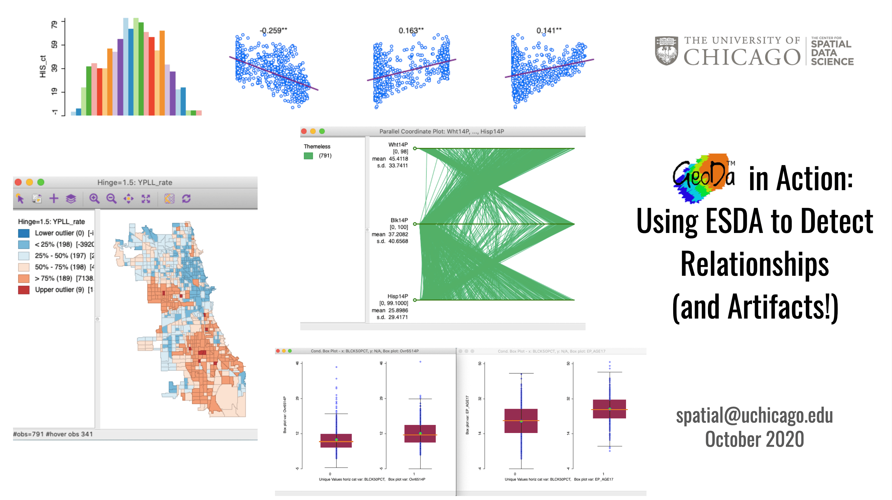

 

 The Puzzle 

Economic hardship has long been associated with worse health outcomes, particularly with more life years lost prematurely. But, in the US, Hispanic immigrants often do better in terms of health even when they face similar socioeconomic issues. Why?

For an overview of this case, see our video [here](https://www.youtube.com/watch?v=sDjuZ1Ak9kQ&t=44s).

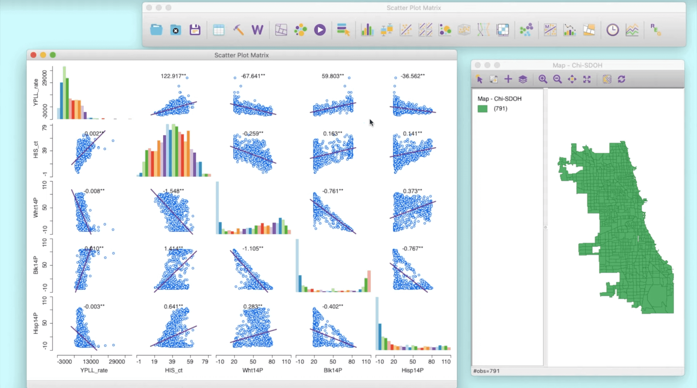

 The Research Design 

We compare premature mortality outcomes for different demographic groups and use a process of abductive reasoning to explore the plausibility of hypotheses that could explain these outcomes.

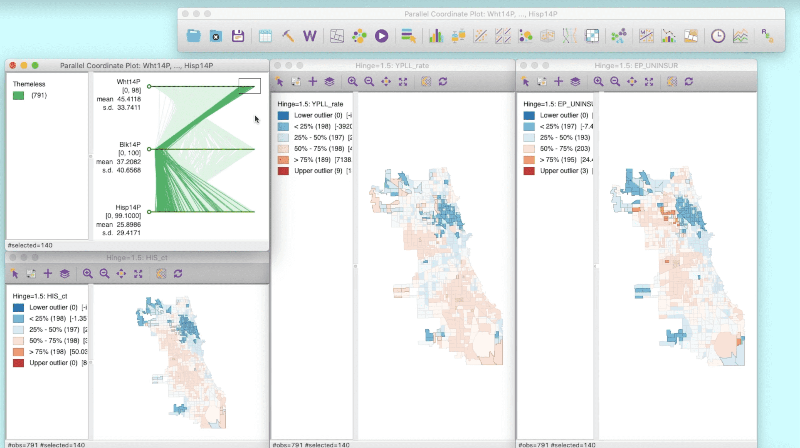

 The Tools 

We test these hypotheses with scatter plots, parallel coordinate plots, conditional box plots and various types of maps -- and with regression analysis.

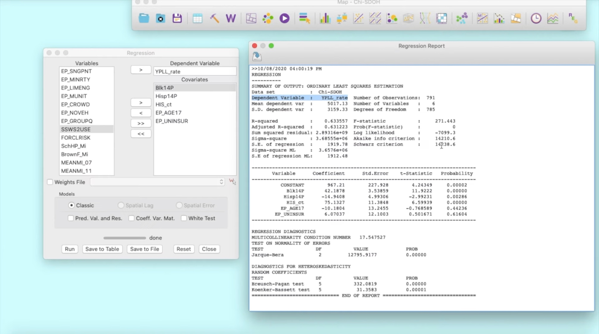

 The Insights 

In the end, while insurance rates for different groups do not seem to explain the difference in health outcomes, younger ages in Hispanic neighborhoods do appear to be the driving factor behind lower premature mortality compared to predominantly White or African-American neighborhoods in Chicago.

## Health and Race: A Preliminary Approach

By **Atman Mehta** (3rd year student in the College)

A protocol that differentiates groups based on racial majorities provides an initial assessment of potential determinants of health indicators

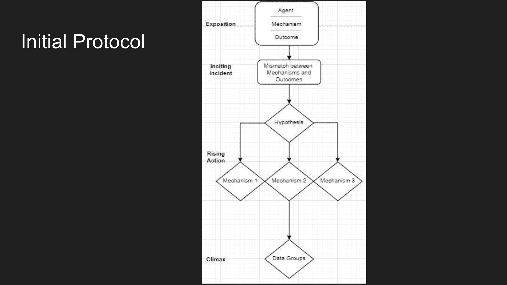

 

 The Puzzle 

How can we create groups to explain differences in outcomes in the social sciences? The question of the determinants of health in Chicago can be used as an example to illustrate this process.

For an overview of this case, see more from our summer project [here](https://uchicago.box.com/s/ganfzzmzonoaqc1of2kzzkw67pgg7csw).

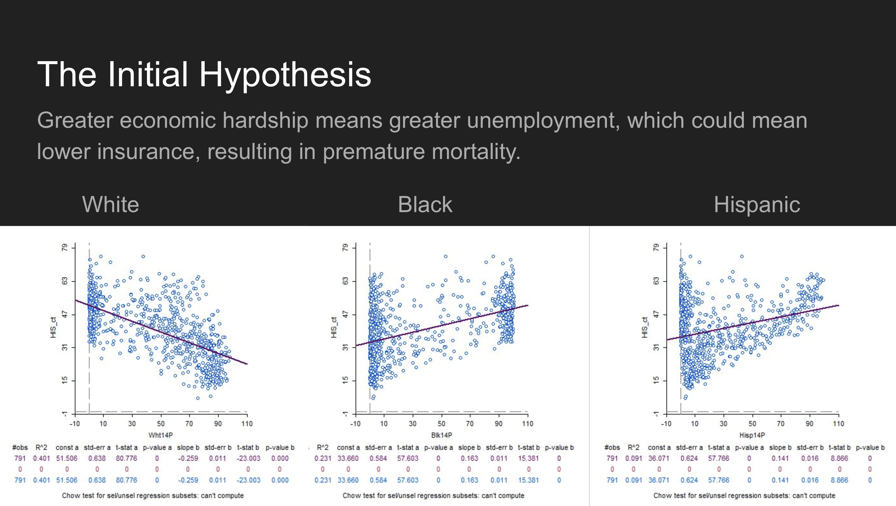

 The Research Design 

Atman first looked at potential plausible explanations and mechanisms, with the main idea being that greater economic hardship means greater unemployment, which means lower insurance and results in premature mortality. He then differentiated demographic groups according to race to test if the variables behaved in the expected ways across tracts with different racial majorities.

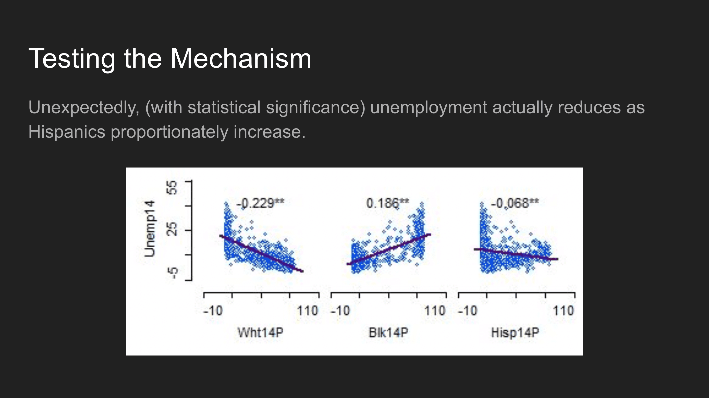

 The Tools 

Several hypotheses were tested by using tools available in GeoDa such as parallel coordinate plots and scatter plots as well as co-location, cluster and LISA maps.

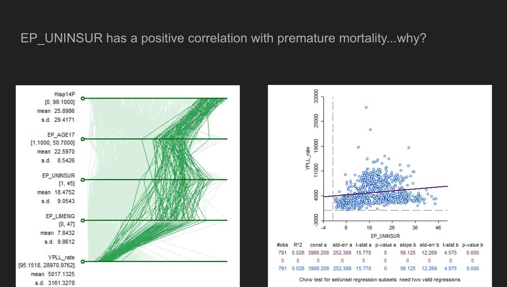

 The Insights 

The resulting protocol helps in structuring the problem at hand in a way that is easy to test. Substantially, dissimilarities in indicators such as premature mortality rates for different racial groups do not seem to be explained by unemployment or violent crime. This puzzle is explored in more detail in the case of The Immigrant Paradox, also available on this website.

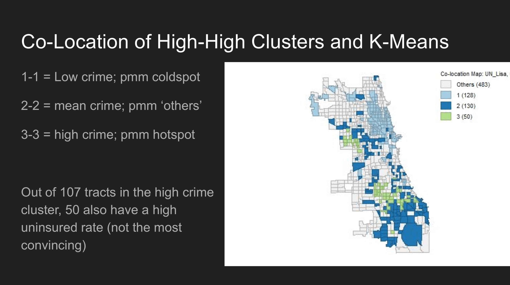

 More Information 

Access our [UPDATE BEFORE PUBLISHING](https://geodacenter.github.io/data-and-lab/snow/) to replicate these findings in [GeoDa](https://geodacenter.github.io).

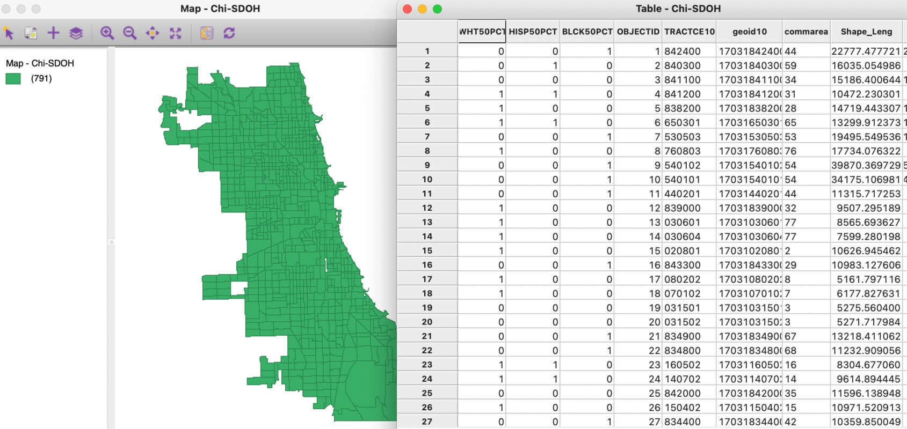

## Turnout and Elections: A Spatial Perspective

By **R.E. Stern** (1st year student in the College)

Changes in turnout in presidential elections from 2012 to 2016, which could have had an impact on their outcome, appear to be related to demographics.

 

 The Puzzle 

What are the factors that explain changes in turnout in the 2016 presidential election compared to previous elections?

For an overview of this case, see more from our summer project [here](https://uchicago.box.com/s/5wu1l2zz8tbwlxm9frvruuicx6ogtw2b).

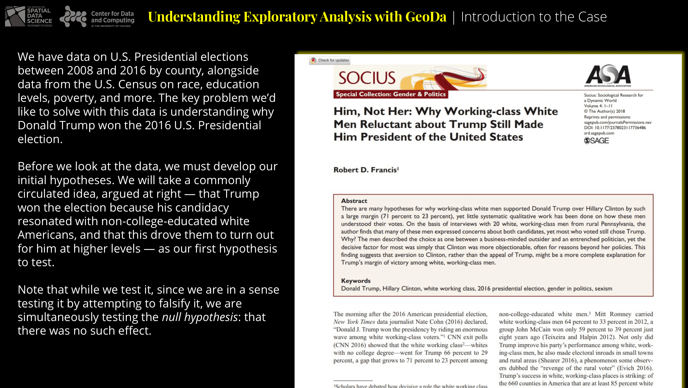

 The Research Design 

R.E.’s protocol highlights the importance of an iterative discovery process, i.e. the continuous testing and re-testing of hypotheses to develop explanatory insights. The hypothesis that non-college white voters turned out to vote in higher numbers in 2016 leads to expectations with an estimated probability that are then tested.

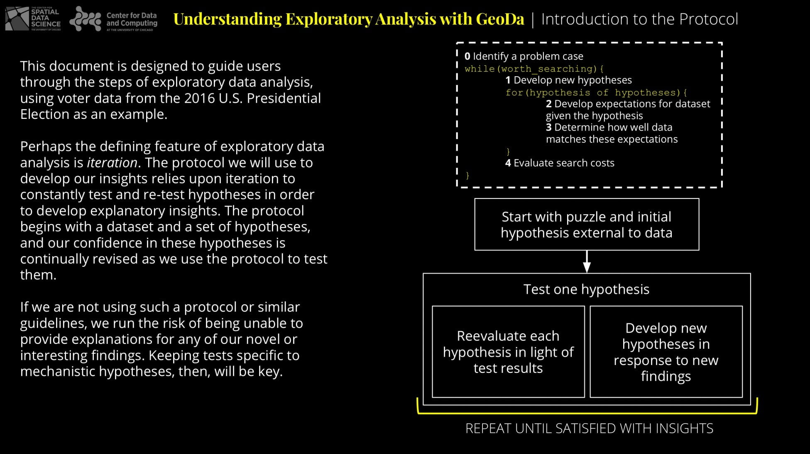

 The Tools 

First, exploratory spatial data analysis tools such as box maps give an overview of the data. Then, GeoDa’s cluster maps such as K-Means or Local Moran’s I allow users to re-assess the probabilities they assign to each hypothesis.

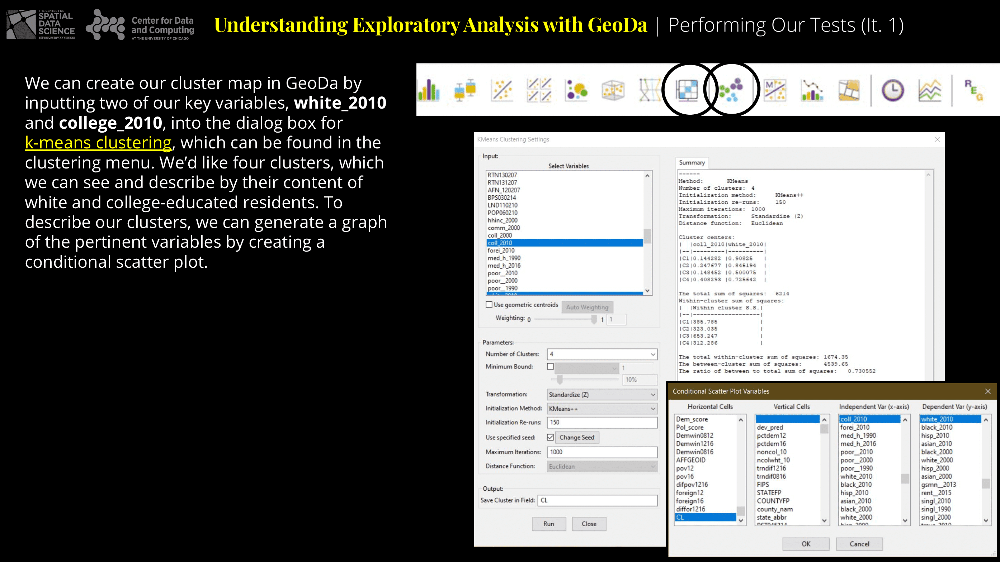

 The Insights 

Counties with more white residents without college degrees did see slightly higher turnout in 2016 compared to 2012 -- more importantly, though, counties with more non-white residents and no college degrees saw less turnout. 

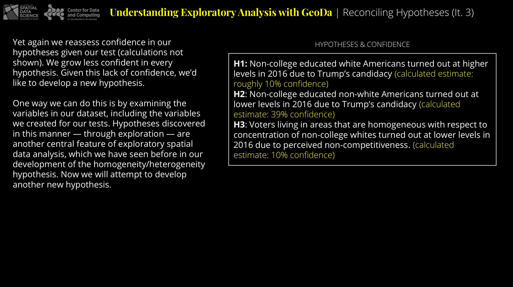

 More Information 

Access our [UPDATE BEFORE PUBLISHING](https://geodacenter.github.io/data-and-lab/snow/) to replicate these findings in [GeoDa](https://geodacenter.github.io).

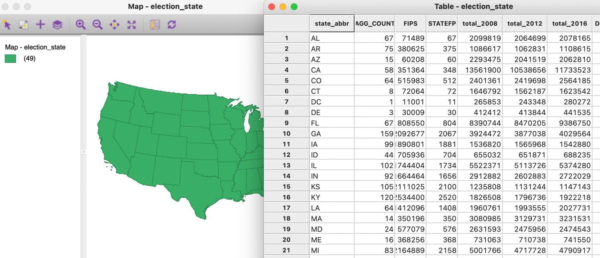

## Asthma and Pollution

By **Mark Baker** (4th year student in the College) and **Jizhou Wang** (3rd year student in the College)

Proximity to potential bus pollution is higher in areas with more residents who are economically vulnerable and African-American, groups which are also at higher asthma risk.

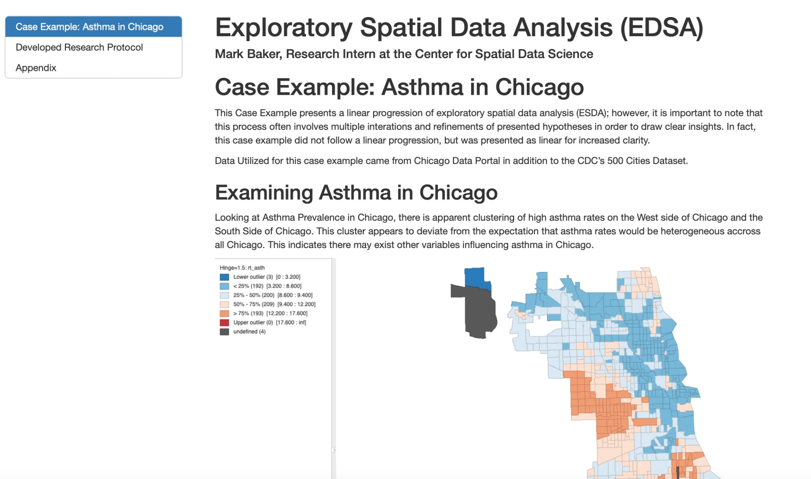

 

 The Puzzle 

Are groups at higher risk of asthma also more likely to be exposed to bus pollution?

For an overview of this case, see [insights](https://uchicago.box.com/s/zmoyz07zwu2opnuovfrogge6ckkwjtpq) and [methods](https://uchicago.box.com/s/1zo055jgec3sxrygvr0unrtsr8ptvb8v) from our summer project.

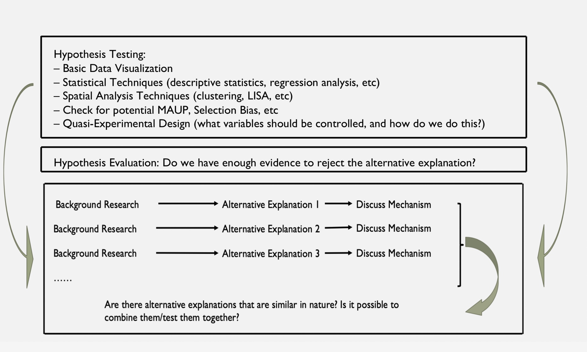

 The Research Design 

Path diagrams outline what factors could be driving spatial concentrations of asthma, including pollution from traffic, lower housing values and older homes. Mechanisms for hypotheses are developed and tested to assess their strength based on a classification by Mark Baker.

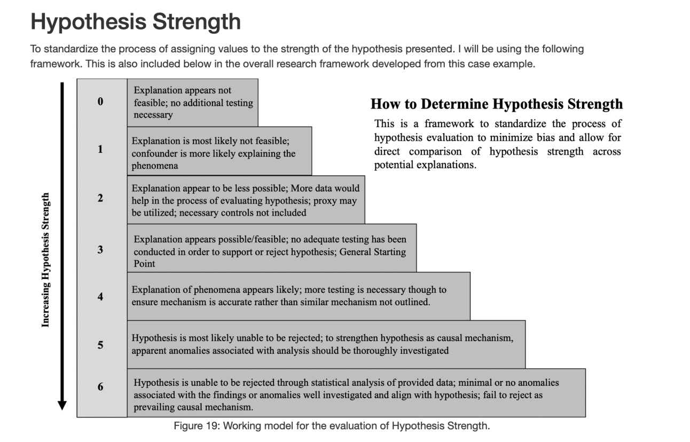

 The Tools 

Mark Baker and Jizhou Wang assess the strength of different hypotheses with boxplots, scatterplots, parallel coordinate plots, cluster analyses, averages charts and regressions in GeoDa.

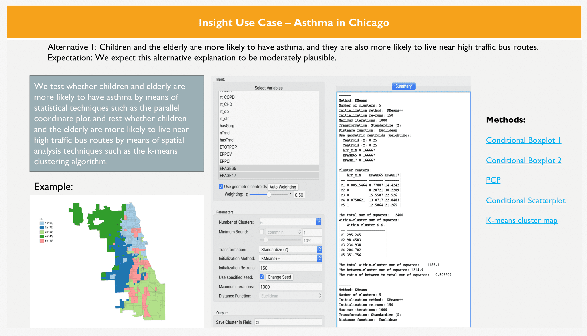

 The Insights 

Economically vulnerable and African-American neighborhoods that have a higher asthma risk are also more likely to be exposed to traffic pollution.

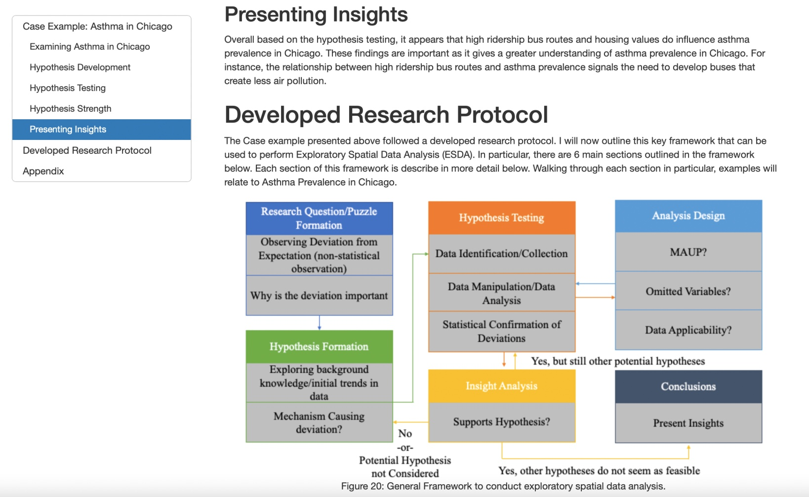

## Racial Diversity: What Built Environment Features Distinguish Racially Diverse from Non-Diverse Areas?

By **Felix Farb** (Junior High School student)

Planning-related factors like highway dividers and land use diversity, as well as out-migration of African-American residents, distinguish racially diverse from non-diverse areas in Chicago.

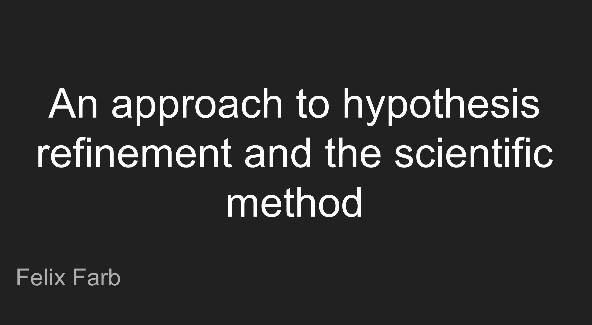

 

 The Puzzle 

Do racially diverse areas in the city of Chicago differ in terms of planning-related factors from non-diverse areas? 

For an overview of this case, see [insights](https://uchicago.box.com/s/pdku4e9rszvhtfnl1mv9o6sdv0ul1j3b) and [methods](https://uchicago.box.com/s/rllzauyb3ew80htdq92i38o0re3q34v0) from our summer project.

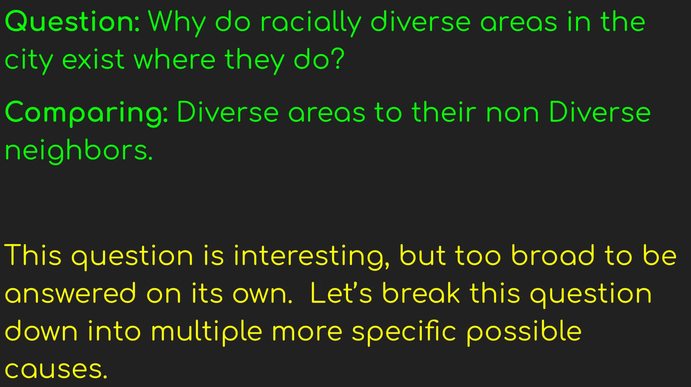

 The Research Design 

An exploratory spatial data analysis identifies areas in Chicago that are racially diverse and compares potential planning-related drivers such as highway dividers and diverse land uses to gentrification. Felix’s protocol demonstrates how hypotheses can be made more and more specific to make them testable.

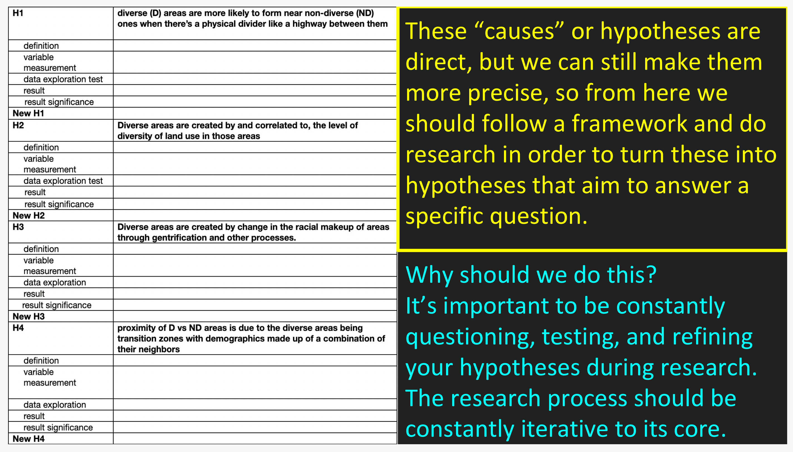

 The Tools 

Different maps, distance buffers, averages charts and K-Means clusters are used to assess the relevance of the results to each hypothesis.

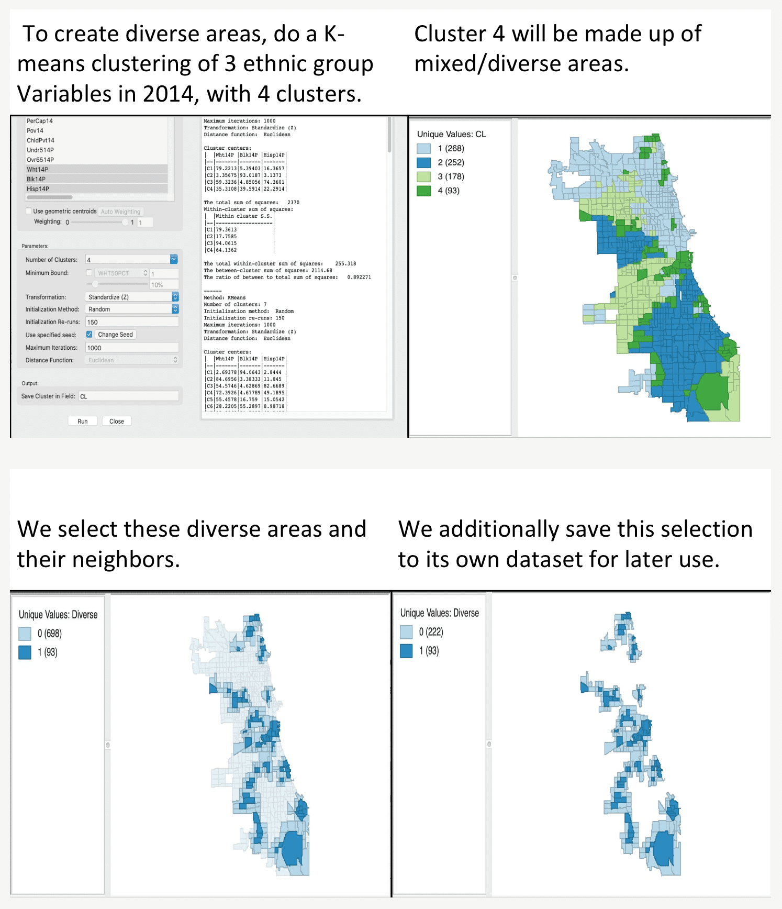

 The Insights 

This initial exploratory analysis suggests that racially diverse neighborhoods in Chicago are more likely to be physically divided from other neighborhoods through highways and have more diverse land uses. Some diverse areas are also characterized by disproportionate out-migration of African-American residents.

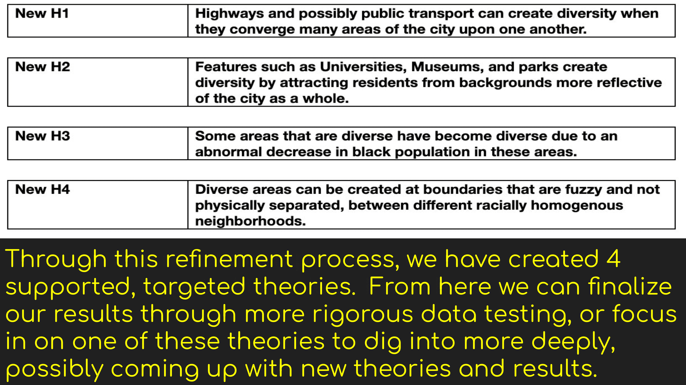

 More Information 

Access our [UPDATE BEFORE PUBLISHING](https://geodacenter.github.io/data-and-lab/snow/) to replicate these findings in [GeoDa](https://geodacenter.github.io).

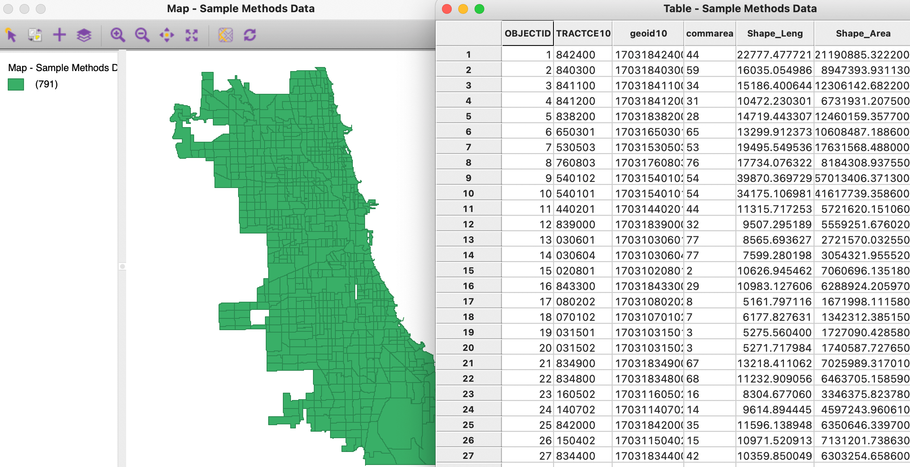

# References {-}
'`
